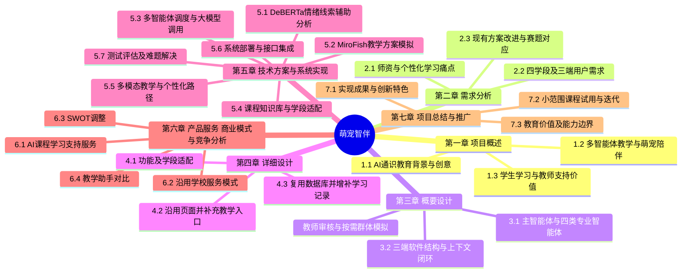

# 萌宠智伴论文思维导图与最小改稿方案

项目名称：**萌宠智伴——基于多智能体协作与群体智能模拟技术的教学智能体**

对应赛题：揭榜挂帅（二）“多模态K12人工智能通识课教学助手对话智能体”，题目编号 JBGS-2026-02。

本方案用于确定作品报告的写作主线，沿用原文七章结构及主要小节编号。原始 Word 文件保持不变。以下“保留”指可以复用原文的材料或设计，不代表已经核验软件实现；新增功能、测试与效果均须以实际原型为准。

## 一 写作定位

全文围绕一个问题展开：如何让不同学段的学生在人工智能通识课程中，获得难度适宜、形式直观、能够及时反馈的学习支持？项目以萌宠作为陪伴入口，以学习支持主智能体协调专业智能体，结合课程知识库、多模态教学与学习记录，形成“提问—讲解—练习—反馈—调整”的学习闭环。教师通过查看学习依据、确认学习安排及按需比较群体模拟方案参与教学决策。

原有情感陪伴、心情记录、积分激励、教师看板和群体模拟可以保留，但其叙述应服务于学习支持。避免只替换作品名称，却仍以心理监测、风险预测和心理干预作为全文主体。

## 二 论文思维导图

以下按原文章节组织，可作为逐章改稿提纲。第五章保留原有 5.1、5.2 位置，再追加赛题要求的技术内容。

### 第一章 项目概述

**1.1 项目背景与创意来源**：开篇改为 AI 通识课程中的教师指导不足、学生理解差异、抽象知识难理解及编程实践反馈不及时。保留萌宠陪伴的创意来源，解释它如何帮助学生愿意提问、持续练习。原心理健康统计不宜继续占据主体。

**1.2 主要功能与特色**：保留“功能架构表＋系统特色”的组织方式。学生端突出课程提问、教学材料、练习反馈、编程求助与成长记录；教师端突出学习状态看板、教学任务、方案比较与审核；管理员端继续承担账号、班级、资源与内容管理。

**1.3 应用与社会意义**：沿用学生、教师、学校三个角度，分别写个性化学习支持、教学反馈与资源复用、课程服务组织。效果使用“旨在”“有助于”等表达，实际提升幅度在测试后填写。

### 第二章 需求分析

**2.1 行业痛点**：由心理服务痛点改为 AI 通识教学痛点，包括学段差异、知识抽象、课程资源分散、编程调试难和学习反馈断裂。

**2.2 用户群体特征与需求分析**：保留原三端需求表，学生需求内部增加四学段：小学低年级、小学高年级、初中、高中。按知识深度、语言风格、教学形式、练习难度说明差异。教师保留班级管理与经验交流需求，补充知识点掌握情况与学习安排审核需求。

**2.3 现有方案改进**：比较通用聊天工具、静态教学资源、在线编程练习工具与本项目。使用可核查的功能维度，避免无来源地宣称竞品不安全或全面落后。小节末补一张“赛题要求—系统功能—对应章节—演示证据”表。

### 第三章 概要设计

**3.1 核心系统架构**：放置本次提供的协作图，按“输入与上下文—主智能体—专业工作智能体—角色回应—行为反馈”说明运行过程，再解释教师决策与群体模拟的支路。

**3.2 软件体系结构**：保留学生端、教师端、管理员端结构。在服务层补充主智能体调度、模型调用、课程资源检索、练习与编程服务、群体模拟服务；数据层区分课程知识、真实学习记录、会话上下文和模拟结果。实际使用哪些服务与组件，须与代码和部署一致。

### 第四章 详细设计

**4.1 项目总体功能概述**：保留教师端、学生端、管理端三个小节。学生端补“选择学段或教材—进入章节—对话讲解—学习材料—练习或编程—反馈”的完整路径。加入主动引导章节内容的例子，而非只支持被动问答。

**4.2 项目页面设计**：尽量复用原有注册登录、萌宠互动、聊天、成长日记、任务、积分、班级管理和论坛页面。对话页补课程资源与练习入口；成长页补知识点与答题记录；教师页补教学安排确认及候选方案对比。只有实际改动或新增的页面才更换截图，不能仅改图注来冒充新功能。

**4.3 项目数据库设计**：复用学生、教师、班级、任务、宠物、积分、论坛、预测记录等既有结构。根据实际实现增补学段/教材偏好、章节与知识点、资源索引、练习作答、代码运行记录、智能体任务记录、教师审批记录等实体或字段。具体新表数量在核对代码后确定，不为写报告而虚构数据库。

### 第五章 技术方案与系统实现

**5.1 DeBERTa情感分析提取模型**：保留原有小节位置，将应用说明收束为学习对话中的情绪线索辅助分析。说明输入文本、输出标签/分数、如何供学习状态分析与情感陪伴使用。知识掌握情况应来自作答、练习与代码反馈，不能直接用情绪分数代替。仅保留确实采用的模型结构、训练方法和实验结果。

**5.2 MiroFish群体智能模拟模型**：保留原有流程图与教师端设计中可复用的部分，将案例从心理趋势预测转向教学候选方案比较。例如比较“直接讲解”“先做小游戏”“分组编程”三种安排。交代学生模拟配置、场景、候选方案、模拟轮次、比较指标及教师审核。模拟输出单独存储，不写入真实学生表现作为事实。

**5.3 多智能体协作与大模型调用策略**：新增主智能体的任务拆分、条件路由、上下文读取、结果整合；说明专业智能体的输入输出、调用顺序与失败处理。列明实际模型名称和用途，说明简单问题如何减少无关调用，复杂任务何时组合调用。多智能体不等于每个角色必须单独部署一个大模型。

**5.4 课程知识库构建与学段自适应**：新增教材或授权教学资源来源、知识点切分、学段/章节/难度标签、索引与检索、回答依据及内容审核。按四学段给出同一知识点的讲解差异。课程知识库与学生上下文用途不同，应分别描述。

**5.5 多模态教学与个性化学习路径**：按实际能力至少覆盖赛题列出的三类方式。为控制新增量，可优先采用“对话问答＋多模态教学资源＋游戏化练习”，并结合图中的编程辅导补在线编程环境。赛题允许后台上传现有教学视频、Word、PPT等资源，不必宣称全部由模型生成。写清资源如何匹配主题、练习如何批改、结果如何改变后续难度与内容。

**5.6 系统部署与集成方案**：交代真实前后端、模型接口、数据存储、部署步骤、使用入口与对接方式。编程功能若包含执行，应写清运行环境、超时与资源限制；只有代码讲解时不能写成已实现在线执行。模拟任务宜与学生即时问答分开处理，具体策略以实现为准。

**5.7 系统测试与难题解决**：补系统级验证，避免整章只有模型原理。记录版本、样本、预期输出、实际输出及问题修复。测试覆盖学段适配、回答准确性、资源匹配、练习反馈、连续对话、路由正确性、教师审批和响应时间。对照“单一通用提示回答”与“本项目协作方案”，判断协作是否带来可测收益；对模拟方案报告稳定性与教师评价，不把仿真结果当作真实教学成效。

### 第六章 产品服务 商业模式与竞争分析

**6.1 产品核心服务**：沿用三端服务结构，改为学生 AI 课程学习支持、教师教学辅助、学校课程资源与平台管理。

**6.2 商业模式**：原学校服务模式可保留，减少与赛题无关的商业扩张篇幅。收费及合作安排如未落实，应标为设想。

**6.3 SWOT分析**：保留表格，优势围绕陪伴入口、教学协作、教师可审核的方案比较；不足如实写课程覆盖、试用规模与生成内容审核成本。

**6.4 行业与竞争分析**：转为教学助手相关功能比较，避免继续以心理咨询产品作为主要对标对象。

### 第七章 项目总结与推广

**7.1 项目总结与创新特色**：按“已实现功能—验证证据—创新作用”写。重点为学习与情绪支持的协作、个体反馈闭环、教师参与的方案比较，避免把常规框架或调用接口本身称为原创算法。

**7.2 应用推广与未来规划**：优先写具体课程与小范围班级试用、教师反馈、资源完善、跨学段验证，再写后续推广。原有大规模试点与国际标准规划若无依据，应压缩为审慎的长期方向。

**7.3 社会价值与未来展望**：围绕学习支持可获得性、教师经验复用和学校课程服务，说明当前适用场景与尚未覆盖内容。

## 三 根据协作图理解项目架构

### 1 当前轮学习支持主流程

学生输入课程问题、倾诉或代码求助后，学习支持主智能体按需读取年级、当前场景、近期心情与学习记录、同场景对话和教师安排，理解目标与约束，制定本轮任务，再按条件委派专业工作智能体。专业结果返回主智能体，由它整合成当前角色的回应。学生继续提问、再次作答、运行代码或更新心情后，反馈进入上下文，供下一轮使用。

四个专业工作智能体是按需调用的能力分工，不应写成每次都固定依次运行，也不应写成所有专业输出分别直接发送给学生。

| 架构组件 | 图中职责 | 报告应说明的内容 |
| --- | --- | --- |
| 学习支持主智能体 | 理解目标、制定任务、路由委派、整合结果 | 调度条件、任务输入输出、上下文选择、结果冲突处理 |
| 学习状态分析智能体 | 识别学习卡点与情绪线索 | 学习表现与情绪证据分开记录，保留不确定性 |
| 教学辅导智能体 | 形成适龄讲解与学习建议 | 知识依据、学段适配、讲解形式、章节引导 |
| 情感陪伴智能体 | 共情回应与支持建议 | 根据学习挫折调整语气和支持方式 |
| 编程辅导智能体 | 定位代码问题与调试步骤 | 错误定位、分步提示及运行反馈的来源 |
| 当前角色回应 | 小知老师、知行老师、宠物伙伴、编程助教 | 对学生的呈现身份，不能与后台专业智能体简单等同 |
| 教师决策 | 查看依据、确认干预、批准学习安排 | 哪类变更需要教师确认，确认后如何执行与留痕 |
| 群体智能模拟 | MiroFish比较候选方案 | 按需触发的教师辅助支路，模拟与真实观察分开 |

图中没有明确“小知老师”和“知行老师”的学段划分或切换规则，现阶段不替项目杜撰。可在第四章按实际产品定义补充；不能仅凭两个名称推断它们对应两个独立后台模型。

### 2 教师决策与群体模拟支路

专业分析提供关注依据与干预建议，教师查看后，可直接确认安排，也可先把候选方案交给群体模拟进行比较。模拟结果返回教师；教师批准的安排再回到主智能体，影响后续学习支持与当前角色回应。

这部分最适合解释项目名称中的“群体智能模拟技术”。建议选择一个清晰教学案例展示其作用，而不是在所有问答里强行加入模拟环节。图中已有的教师审核关系应在报告、交互页面和演示中保持一致。

### 3 一条贯穿报告的演示案例

以初中生学习 Python 循环为例：学生说“循环总写错，我不想学了”并提交代码。主智能体结合学段与历史记录，将错误定位交给编程辅导，将挫折线索交给情感陪伴，必要时由学习状态分析汇总反复出错的知识点。教学辅导给出适龄解释与小练习，主智能体把结果整合成统一回应。学生修改代码并再次作答，系统记录结果并调整下一步内容。

若班级中多人在同一知识点持续卡住，教师可以比较“统一重讲”“分组互助”“分层练习”等安排，按需参考模拟报告后确认方案。上述为拟定演示脚本，需要用真实页面、调用记录和作答反馈验证后，才能写为系统已实现流程。

## 四 赛题覆盖与最小新增量

| 赛题要求或评分项 | 原材料可复用部分 | 必须补充或验证的内容 | 报告位置 |
| --- | --- | --- | --- |
| 智能体设计合理性 25% | 协作图、三端结构 | 主智能体路由、大模型调用策略、四学段适配 | 第3章，5.3，5.4 |
| 多模态交互质量 25% | 聊天与任务页面 | 至少三类方式的真实入口、内容与反馈 | 4.2，5.5，5.7 |
| 教育适配性与实用性 20% | 学生记录、成长目标 | AI通识知识库、四学段案例、学习路径调整 | 第2章，5.4，5.5 |
| 用户体验 15% | 萌宠、积分、成长记录 | 练习与知识点关联、即时反馈、响应时间验证 | 第4章，5.7 |
| 创新性 15% | 多智能体协作图、教师推演 | 协作收益及模拟辅助教学的具体证据 | 5.2，5.3，5.7，7.1 |
| 可运行原型与集成部署 | 原有系统和技术选型描述 | 实际启动、模型接入、访问入口与部署复现 | 5.6 |
| 报告必需技术内容 | 原第5章两类模型说明 | 知识库、多模态路线、大模型策略、难题与解决方案 | 5.3至5.7 |

“三类交互”按赛题列出的六种方式计，不把聊天窗口切换三个角色算成三类，也不把三个文本按钮算成多模态。若选择教学资源推荐，应展示实际可用的视频或文档/PPT及其主题匹配；若选择游戏化练习，应展示批改和后续反馈。动画与绘本可作为增量项，是否纳入取决于真实完成度。

## 五 原文最小改动清单

| 原文位置 | 改动方式 | 控制改动量的方法 |
| --- | --- | --- |
| 封面与目录 | 必改 | 使用新名称，按本赛事要求更换旧赛名和旧作品编号信息，更新目录 |
| 第1章和第2章 | 重点改叙述 | 保留标题、表格结构和三端分析方法，调整背景与功能主次 |
| 3.1核心系统架构 | 更新核心图与说明 | 采用用户提供的协作图，补齐两条流程的解释 |
| 3.2软件体系结构 | 局部补充 | 保留三端结构，增加教学服务与课程数据说明 |
| 4.1功能概述 | 局部改表 | 复用模块，增加教学目标、资源、练习与学习反馈 |
| 4.2页面设计 | 有变化再换截图 | 大部分基础页面可保留，教学新入口须有实际截图 |
| 4.3数据库设计 | 按真实实现增补 | 复用原表与编号，不整体推倒重建 |
| 5.1 DeBERTa | 保留位置并收束用途 | 精简与本项目无直接关系的模型堆叠和心理预测措辞 |
| 5.2 MiroFish | 保留位置并调整案例 | 用教学方案比较替换心理趋势精准预测的主叙述 |
| 5.3至5.7 | 集中新增 | 把赛题硬性缺项集中写入，避免改乱前文目录 |
| 第6章 | 少量替换与压缩 | 保留服务模式与SWOT形式，更新教育场景对标 |
| 第7章 | 调整结论与成果口径 | 已完成、已验证、拟实现分开表述 |
| 参考文献 | 对应修订 | 正文保留哪些技术与数据，就核验和保留对应来源 |

## 六 原文需要核实的论断

原文包含“心理风险检测准确率达99%”“经试点应用验证”“平均KL散度低于0.15”等表述。改稿时需要逐项区分引用的外部研究结果、本项目实测结果与目标值；没有对应记录的数字不能保留为项目成果。

原文还把情绪分析与社交影响力、人格、群体角色等较复杂属性直接联系起来。新的报告应分别交代数据来源与计算方法，不把情绪分类输出扩写成已经准确掌握学生人格或社会关系。MiroFish的具体框架能力、版本、模拟流程及依赖应另行对照实际使用版本核查；本方案没有将旧稿介绍视为已经证实的技术事实。

涉及模拟的传播系数、轮次与真实时间对应关系，如无校准依据，应标为实验设定。模拟所得的方案优劣需要教师判断与后续真实反馈验证，不使用“精准预测真实学生未来状态”这样的确定性结论。

## 七 后续改稿顺序与材料依据

建议先完成第三章架构说明及第五章新增技术小节，确定系统究竟实现了什么；再按真实功能调整第一、二章和第四章；最后修改第六、七章、封面、目录、图表与引用。这个顺序可以减少前文承诺与后文实现不一致造成的返工。

本方案依据以下用户提供材料整理：

- 原设计开发文档：沿用其中七章结构及已有三端、情感陪伴、DeBERTa与MiroFish相关材料。
- 揭榜挂帅（二）赛题：确定K12人工智能通识课定位、至少三类交互、个性化学习、可运行原型、报告内容与评分权重。
- 智能体协作图：确定主智能体、四类专业工作智能体、角色回应、上下文更新、教师决策与按需群体模拟的关系。
- 预通知与延期通知：用于核对提交与时间安排。按所提供延期通知，报名截止为2026年9月28日，材料提交截止为2026年10月9日24时；此处仅复述附件，不代表已核查后续更新。

赛题材料列明初赛提交作品报告PDF、演示视频和介绍PPT。本次产出是写作思维导图与改稿方案，尚不是最终参赛报告。原预通知要求作品材料匿名，因此旧封面、截图、页眉页脚及文档属性中的学校、团队和个人身份信息须在制作提交版时一并检查。
